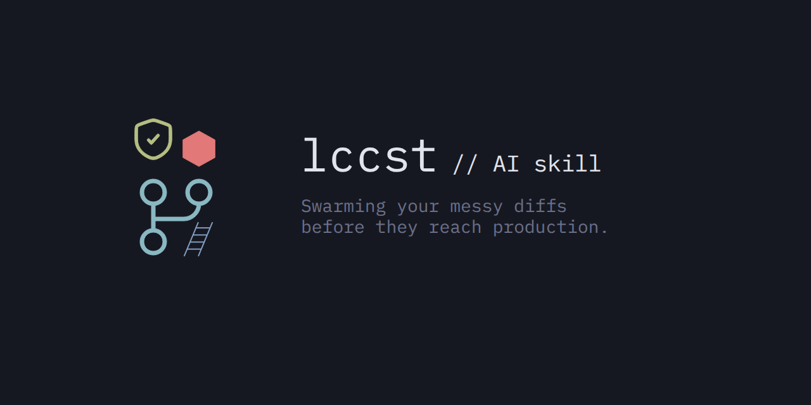

# LCCST (Locust)



A deterministic workspace gatekeeper that enforces architectural cohesion and
SOLID invariants through a lean execution protocol. Decomposes codebase changes
into isolated, test-verified, atomic Git commits with zero meta-cognition tax.

Locust operates as a structural integrity guardian for codebase health, test
coverage, and architectural boundaries -- built to put your
preferences first.

> "Swarming your messy diffs before they reach production."

The execution model is a flat 3-step path: wipe stale artifacts, seed via
`/init`, then generate application files directly. No multi-phase loops or
phase-checking pauses. Architectural guardrails (anti-god-object, strict
typing, defensive engineering) and ecosystem discovery (Tooling Ladder,
manifest scanning) remain active during code generation to enforce quality.

## Runtime Modes

Locust runs in two modes depending on your environment:

### Bare Skill Mode

The protocol specification (`SKILL.md`) is loaded directly into the LLM's
context window. The model follows the rules manually -- detecting languages,
running commands, and committing changes. No MCP server required.

### MCP Server Mode (Reference: `src/swarm/`)

The MCP server at `src/index.ts` (built to `dist/index.js`) exposes the full
protocol via tools and prompts -- all logic is self-contained in a single
distributable file. AI agents can call the `/init`, `/audit`, and `/swarm`
tools programmatically.

See [src/swarm/README.md](src/swarm/README.md) for more details.

```bash
# Go Example
/init -> Detects go.mod -> swarm runs `go test ./...`
# Rust Example
/init -> Detects Cargo.toml -> swarm runs `cargo test`
# Python Example
/init -> Detects pyproject.toml -> swarm runs `uv run pytest`
# Node.js Example
/init -> Detects package.json -> swarm runs `pnpm test`
# Julia Example
/init -> Detects Project.toml -> swarm runs `julia --project=. -e "using Pkg; Pkg.test()"`
# CMake Example
/init -> Detects CMakeLists.txt -> swarm runs `cmake --build .`
```

## Operational Persona: The Virtual Staff & Release Engineer

Within your workspace ecosystem, Locust acts as a hybrid **Staff Architect**
and hyper-vigilant **Release Engineer**. It does not just facilitate changes;
it ensures every modification complies with long-term engineering health. Like
a disciplined peer, it actively prevents the creation of anti-patterns,
automates versioning overhead, and refuses to stage or commit code that drops
below strict quality thresholds.

## Ecosystem Placement: The Quality Counter-Weight

While the modern AI engineering space is heavily saturated with tools focusing
strictly on compression and cost-reduction, Locust provides the missing
philosophical balance. It is built to run standalone or alongside token-cutters.

| Tool Layer | Focus | Tactical Mechanism |
|---|---|---|
| **[Ponytail](https://github.com/DietrichGebert/ponytail)** | Code Minimisation | Prevents agent boilerplate bloat. |
| **[Headroom](https://github.com/chopratejas/headroom)** | History Reduction | Trims context logs and chat data. |
| **[Caveman](https://github.com/JuliusBrussee/caveman)** | Output Compression | Strips syntax token overhead. |
| **Locust (LCCST)** | **Payload Integrity** | **Enforces typing, lints, and tests.** |

### The Token Investment Philosophy

The project name itself embodies this duality: **LCCST** stands as a direct pun
on **Low Cost** asset management while algorithmically executing **Locality
Clustering** over your workspace tree.

Tools like Ponytail stop the AI from writing *too much* code, but they cannot
stop it from breaking your architectural boundaries. Locust treats tokens as
strategic capital -- invested into the Tooling Ladder to eliminate the
exponentially higher downstream costs of debugging broken production builds,
untangling messy Git histories, or fixing silent runtime type failures.

> **v3.1 eliminates the meta-cognition tax.** Earlier versions spent runtime
> tokens on multi-phase execution loops and internal compliance tracking.
> Version 3.1.0 replaced that with a flat 3-step path: wipe, seed via `/init`,
> generate. Guardrails (typing, defensive engineering, ecosystem discovery)
> remain active in the *output structure*, not in the model's reasoning loop.
> The result: FCT stays lean (~7k guided), ART drops back toward baseline.

## Core Philosophy

1. **UNIX philosophy over framework**: A simple single-file SKILL.md and
   index.js Model Context Protocol (MCP), nothing more required.
   Over-engineering is bad for auditing, adds technical debt and
   needless complexity for nothing.

2. **User Preference Overrides:** Your explicit preferred design patterns and
   target logic always take priority when defining application payloads.
   However, the core safety gates of the pipeline -- including atomic hunk
   isolation, the Tooling Ladder, and strict test-pass verification -- are
   non-negotiable workspace invariants designed to prevent structural
   regressions.

3. **Streamlined Initialisation:** Use the `/init` command on startup to kick
   off immediate, automated codebase scans, helping you audit repository
   health and catch architectural documentation gaps before any changes begin.

4. **Interactive Engagement Loop:** No abrupt dead ends. The system maintains
   continuous, collaborative dialogue -- prompting you for confirmations,
   staging approvals, or clarifying implementation paths.

5. **Proactive Semantic Discovery & Testing:** Leverages Language Server
   Protocol (LSP) data, Tree-sitter AST queries, and native testing frameworks
   to dynamically trace downstream side-effects.

6. **Ecosystem-Native Architecture:** Enforces strict type-safety boundaries,
   modern project layout orchestrators, and single-responsibility interfaces
   (while dynamically allowing cohesive multi-method structures like unified
   HTTP handlers).

7. **Defensive Engineering & Compliance:** Mandates validation boundaries
   across entry points, filters token overhead, audits package licences, and
   automatically adapts to both monolithic and modular/versioned changelog
   layouts using SemVer rules.

8. **Quality over Velocity:** Prioritise structural integrity and complete
   test verification over raw execution speed. Version 3.1.0 strips the
   meta-cognition tax by replacing multi-phase execution loops with a flat
   3-step path. Token discipline is enforced at the output level, not as
   internal reasoning rules.

9. **Granularity over Convenience:** Reject the temptation to bundle
   multi-domain fixes into single execution blocks. Locust applies strict
   **Locality Clustering** to group workspace diffs by their functional
   domain boundaries. The overhead of creating multiple atomic commits is
   deliberately chosen to guarantee easy code rollbacks and crystal-clear
   repository history.

---

## Playground and Benchmarking

See [`playground/README.md`](playground/README.md) for the benchmarking suite
that measures token impact of skill-guided vs plain code generation across
three reference projects (Python HTTP server, React timer, Go login CRUD).

### Verification Matrix & Baseline Benchmarks

The baseline metrics below were captured using our automated evaluation
harness. The data highlights the concrete performance delta observed between
unguided generation and structured protocol compliance.

Two distinct token metrics are tracked:
* **FCT (File-Content Tokens):** Static token footprint of final source
  files (measured via `tiktoken` post-run).
* **ART (Agent Runtime Tokens):** Cumulative prompt + completion tokens
  consumed during the agent loop (captured via the `track_runtime.py`
  proxy).

> ART is captured per-subproject via the `lccst-telemetry` MCP server, giving
> a perfect trace of agent development costs. See the
> [methodology guide](playground/README.md) for the full breakdown.

Scores are fully normalised to a 100-point scale using domain-specific
evaluation profiles. Each subproject is graded on features relevant to its
architectural domain (e.g., UI components are not penalised for missing
encryption patterns).

<!-- BENCHMARK_RESULTS_START -->

#### opencode-ling-3.0-flash-free: skill version v3.1.0

| Agent Runtime | LLM Engine | Skill Layer | Context Tools (MCP) | Subproject | Plain Score | Skill-Guided | Test Status | FCT (Plain) | FCT (Guided) | ART (Plain) | ART (Guided) |
| :--- | :--- | :--- | :--- | :--- | :---: | :---: | :---: | :---: | :---: | :---: | :---: |
| **opencode** | `ling-3.0-flash-free` | `v3.1.0` | `lccst-telemetry` | **python-http-server** | 32/100 | **100/100** | PASSED | 528 | 2,221 | 3,900 | 1,850 |
| **opencode** | `ling-3.0-flash-free` | `v3.1.0` | `lccst-telemetry` | **react-timer** | 22/100 | **100/100** | PASSED | 428 | 992 | 750 | 1,600 |
| **opencode** | `ling-3.0-flash-free` | `v3.1.0` | `lccst-telemetry` | **go-login-crud** | 65/100 | **100/100** | PASSED | 812 | 4,495 | 800 | 1,800 |
| **Summary** | | | | **Workspace Totals / Avg** | **40/100** | **100/100** | **3/3 Passed** | **1,768** | **7,708** | **5,450** | **5,250** |

> **Highest ART subproject:** `python-http-server` consumed the most guided
> runtime tokens.
> **Highest FCT subproject:** `go-login-crud` consumed the most guided FCT
> tokens.
> Skill-guided implementation used **+336%** more FCT and **-4%** more ART
> compared to plain implementation across the workspace suite.

#### opencode-deepseek-v4-flash-free: skill version v3.1.0

| Agent Runtime | LLM Engine | Skill Layer | Context Tools (MCP) | Subproject | Plain Score | Skill-Guided | Test Status | FCT (Plain) | FCT (Guided) | ART (Plain) | ART (Guided) |
| :--- | :--- | :--- | :--- | :--- | :---: | :---: | :---: | :---: | :---: | :---: | :---: |
| **opencode** | `deepseek-v4-flash-free` | `v3.1.0` | `lccst-telemetry` | **python-http-server** | 48/100 | **100/100** | PASSED | 590 | 2,284 | 5,300 | 4,700 |
| **opencode** | `deepseek-v4-flash-free` | `v3.1.0` | `lccst-telemetry` | **react-timer** | 22/100 | **100/100** | PASSED | 462 | 1,614 | 1,800 | 4,000 |
| **opencode** | `deepseek-v4-flash-free` | `v3.1.0` | `lccst-telemetry` | **go-login-crud** | 49/100 | **100/100** | PASSED | 1,149 | 4,264 | 2,300 | 5,300 |
| **Summary** | | | | **Workspace Totals / Avg** | **40/100** | **100/100** | **3/3 Passed** | **2,201** | **8,162** | **9,400** | **14,000** |

> **Highest ART subproject:** `go-login-crud` consumed the most guided runtime
> tokens.
> **Highest FCT subproject:** `go-login-crud` consumed the most guided FCT
> tokens.
> Skill-guided implementation used **+271%** more FCT and **+49%** more ART
> compared to plain implementation across the workspace suite.

#### opencode-hy3-free: skill version v3.1.0

| Agent Runtime | LLM Engine | Skill Layer | Context Tools (MCP) | Subproject | Plain Score | Skill-Guided | Test Status | FCT (Plain) | FCT (Guided) | ART (Plain) | ART (Guided) |
| :--- | :--- | :--- | :--- | :--- | :---: | :---: | :---: | :---: | :---: | :---: | :---: |
| **opencode** | `hy3-free` | `v3.1.0` | `lccst-telemetry` | **python-http-server** | 32/100 | **100/100** | PASSED | 620 | 2,214 | 3,680 | 8,250 |
| **opencode** | `hy3-free` | `v3.1.0` | `lccst-telemetry` | **react-timer** | 22/100 | **100/100** | PASSED | 490 | 1,177 | 9,950 | 14,700 |
| **opencode** | `hy3-free` | `v3.1.0` | `lccst-telemetry` | **go-login-crud** | 32/100 | **100/100** | PASSED | 820 | 3,601 | 17,400 | 24,100 |
| **Summary** | | | | **Workspace Totals / Avg** | **29/100** | **100/100** | **3/3 Passed** | **1,930** | **6,992** | **31,030** | **47,050** |

> **Highest ART subproject:** `go-login-crud` consumed the most guided runtime
> tokens.
> **Highest FCT subproject:** `go-login-crud` consumed the most guided FCT
> tokens.
> Skill-guided implementation used **+262%** more FCT and **+52%** more ART
> compared to plain implementation across the workspace suite.


### Benchmark Summary

| Metric | opencode-ling-3.0-flash-free | opencode-deepseek-v4-flash-free | opencode-hy3-free |
| --- | --- | --- | --- |
| Plain score | 40/100 | 40/100 | 29/100 |
| Guided score | 100/100 | 100/100 | 100/100 |
| Plain FCT | 1,768 | 2,201 | 1,930 |
| Guided FCT | 7,708 | 8,162 | 6,992 |
| FCT overhead | +336% | +271% | +262% |
| Plain ART | 5,450 | 9,400 | 31,030 |
| Guided ART | 5,250 | 14,000 | 47,050 |
| ART overhead | -4% | +49% | +52% |
| Tests passed | 3/3 | 3/3 | 3/3 |

#### Token Efficiency

All evaluated models (`opencode-ling-3.0-flash-free`,
`opencode-deepseek-v4-flash-free`, and `opencode-hy3-free`) achieved a perfect
guided score of 100/100 under the protocol. However, their resource efficiency
varied significantly:

* **opencode-ling-3.0-flash-free** entered with the strongest plain baseline
  (40/100) and reached perfection with +336% FCT and -4% ART overhead --
  representing a genuine quality investment rather than recovery from failure.

* **opencode-hy3-free** was the most token-efficient at +262% FCT with +52% ART
  overhead, though its lower plain baseline (29/100) means the overhead figure
  partly reflects additional rounds of correction.

* **opencode-deepseek-v4-flash-free** also delivered a perfect guided score,
  with +271% FCT and +49% ART overhead.

Across all runners, `go-login-crud` remained the most resource-intensive
subproject.

#### Least Token Usage

opencode-ling-3.0-flash-free consumed the fewest tokens overall (20,176): 1,768
plain FCT, 7,708 guided FCT, 5,450 plain ART, and 5,250 guided ART.

#### Overall Top Models

| Rank | Agent-Model | Plain Score | Guided Score | FCT Overhead | ART Overhead | Verdict |
| ---: | :--- | :---: | :---: | :---: | :---: | :--- |
| 1 | opencode-ling-3.0-flash-free | 40/100 | 100/100 | +336% | -4% | Best overall |
| 2 | opencode-deepseek-v4-flash-free | 40/100 | 100/100 | +271% | +49% | Strong contender |
| 3 | opencode-hy3-free | 29/100 | 100/100 | +262% | +52% | Strong contender |

<!-- BENCHMARK_RESULTS_END -->

### Core Architectural Insights

* **The Token Trade-Off (FCT):** The skill-guided protocol introduces a
  deliberate file-content token overhead (see FCT columns above) to fund
  explicit typing, robust error-handling, and mandatory unit testing.
* **Agent Runtime Tokens (ART):** The harness tracks a runtime investment
  across skill-guided development cycles. The heaviest subproject (noted in
  the table above) typically accounts for the largest share of guided ART,
  isolating structural errors during the gated plan-to-execute transition.

> Note: Detailed metric partitioning, line count growth, and feature
> completeness matrices are available in the comprehensive playground
> breakdown. See individual reports for per-version traces.
>
> `headroom` MCP is used for all benchmarks. Follow their setup instructions.

### Adding Benchmarks for Other Models

Feel free to clone the repository and contribute your agent-specific metrics
to the main matrix. Refer to the [playground README](./playground/README.md)
for further details.

Contributions are welcome, especially for frontier models and local
powerhouses like Claude, GPT, Gemma 4 and GLM 5.2.

---

## Installation

### Option A: GitHub Releases (Recommended)

> **Pre-built, no build step required.**

Download the latest release assets from the
[releases page](https://github.com/bladeacer/lccst/releases). Each release
bundles `dist/index.js` (self-contained MCP server), `SKILL.md`,
`dist/index.d.ts`, `LICENSE`, and `README.md`.

After downloading, set the correct path to `dist/index.js` in your agent
configuration file (see Option D for MCP configuration examples). No `npm
install` or build is needed -- `dist/index.js` is fully self-contained.

### Option B: Zero-Setup Declarative Ingestion

> **Download once, run everywhere.**

For instruction-driven workflows, direct CLI executions, or platforms that do
not need background processes.

#### Claude Code CLI

Inject the specification directly via runtime file referencing:

```bash
claude "Review the active git diff using the parameters in ./SKILL.md"
```

#### GitHub Copilot & OpenCode Agents

Reference or pin the file within your conversational prompt context using `@`
or `#` shortcuts depending on your host interface:
* Attach `#SKILL.md` or `@SKILL.md` into your chat input interface.
* Target Execution Prompt: `"Execute the protocol loop defined in this file
  over my uncommitted workspace changes."`

#### Codex & Independent Agent Harnesses

Pipe the raw text content into initialisation runs or supply it through
custom extension layers:

```bash
cat SKILL.md | your-agent-runner "Apply this system execution skill"
```

#### Project-Level Workspace Binding (Automated Rule Locking)

To permanently bind an AI agent to the Locust framework constraints without
typing manual prompt triggers, save or symlink `SKILL.md` directly into your
repository root using the appropriate file target:
* **Cursor IDE:** Save file as `.cursorrules` in your project root.
* **Cline / VS Code AI Agents:** Save file as `.clinerules` in your project
  root.
* **GitHub Copilot (Editor):** Save file as
  `.github/copilot-instructions.md`.

#### Global Editor Profiles

To apply these rules globally across all open development spaces on your
machine, copy the raw content of `SKILL.md` and paste it inside your
editor's global behavioural configuration field:
* **Cursor:** Navigate to `Settings -> Features -> Rules for AI` and append
  the ruleset.
* **Windsurf:** Navigate to `Settings -> Memories` and create or edit a
  global rules entry with the SKILL.md content.
* **VS Code (Cline / Continue):** Create or edit
  `~/.vscode/globalRules.json` with the ruleset content, or paste directly
  into the extension's global configuration panel.
* **JetBrains (AI Assistant):** Navigate to
  `Settings -> Tools -> AI Assistant -> Custom Prompts` and add the ruleset
  as a project-level or global instruction.
* **GitHub Copilot (CLI):** Set `GITHUB_COPILOT_INSTRUCTIONS` environment
  variable to point to a local copy of `SKILL.md`, or append the content to
  `~/.github/copilot-instructions.md`.

---

### Option C: Universal Package Registry Integration

> **The package manager route. One command, multi-agent deployment.**

For platforms and command-line interfaces that natively implement the
decentralised **Agent Skills Standard** (e.g., Claude Code, Cursor, Windsurf,
Roo Code, Gemini CLI, Codex). This directly registers the root-level
`SKILL.md` file layout to your environment using the global skills
infrastructure.

Install the skill block directly from the public GitHub source path:

```bash
npx skills add bladeacer/lccst
```

#### Executing the Workspace Module

Once mapped through the universal package engine, invoke the system execution
pipeline via your terminal runner profile or active agent interface:

```bash
/lccst
```

---

### Option D: Model Context Protocol (MCP) Server Setup

> **Clone, install, build, configure.**

Clone the repository and install dependencies:

```bash
git clone --depth 1 https://github.com/bladeacer/lccst
cd lccst
pnpm install
pnpm run build
```

For AI runners that support automated standard I/O (stdio) communication
daemons (e.g., Claude Code, Cursor, Cline, Windsurf, Codex, Pi, OpenCode,
Gemini CLI / Antigravity).

Add the following configuration object to your global or project-level MCP
server connection arrays (such as `claude_desktop_config.json`):

```json
{
  "mcpServers": {
    "lccst": {
      "command": "node",
      "args": ["/absolute/path/to/lccst/dist/index.js"]
    }
  }
}
```

> **Important:** Replace `/absolute/path/to/lccst/dist/index.js` with the
> actual path to `dist/index.js` on your system. If you downloaded from
> GitHub Releases (Option A), point it to the downloaded file location.

The MCP server exposes three tools for programmatic use:
* **`init`** -- Map project conventions and verify environment
* **`audit`** -- Scan workspace diffs and generate commit plan
* **`swarm`** -- Execute the full discovery-cluster-test-commit loop

#### OpenCode Setup

OpenCode uses an `opencode.jsonc` file at the project root for MCP server
configuration and skill registration.

##### Registering the Main LCCST MCP Server

Add the following to your `opencode.jsonc`:

```jsonc
{
  "$schema": "https://opencode.ai/config.json",
  "mcp": {
    "lccst": {
      "type": "local",
      "command": ["node", "/absolute/path/to/lccst/dist/index.js"],
      "enabled": true
    }
  }
}
```

Replace the path with your actual `dist/index.js` location.

##### Referencing as a Skill

The `SKILL.md` file is an [Agent Skill](https://agentskills.io/specification).
OpenCode automatically discovers skills named `SKILL.md` at the project root.
To invoke Locust within a conversation, use the `/lccst` command or reference
`@SKILL.md` in your prompt.

##### Available Test Scripts

```bash
pnpm run build      # Bundle deps + source -> dist/index.js
pnpm run test       # Run all tests (22 unit + 6 integration)
pnpm run test:swarm # Swarm library unit tests only
pnpm run test:mcp   # MCP server integration tests only
pnpm run bump 3.0.1 # Bump version across all files
```

---

## Development

### Developer Dependencies

| Tool | Version | Purpose |
|------|---------|---------|
| pnpm | >= 9 | Package manager (engine + playground Node projects) |
| TypeScript | >= 5.4 | Compiling engine source |

Benchmarking has its own set of dependencies, see details in
[playground README](/playground/README.md).

## LLM Usage Disclosure

It's an AI skill, AI assistance was used in the making of this project.
Architectural, design decisions and ensuring the code works as intended was
done by a human.

## Credits

Locust was heavily inspired by
[ponytail](https://github.com/DietrichGebert/ponytail).

The logo and posters uses
[the Iceberg Dark colour scheme by cocopon](https://cocopon.github.io/iceberg.vim/).

[IBM Plex Mono](https://github.com/IBM/plex) was used for typography.

The [Agent Skills specification](https://agentskills.io/specification).

## License

This project is open-source and licensed under the terms of the MIT License.
