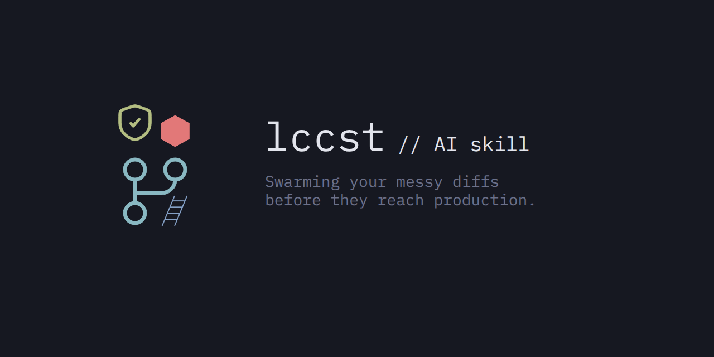

# LCCST (Locust)

A deterministic workspace gatekeeper that decomposes codebase changes into
isolated, test-verified, atomic Git commits. Enforces architectural cohesion
and SOLID invariants through a lean execution protocol.

> "Swarming your messy diffs before they reach production."

## Runtime Modes

### Bare Skill Mode

Load `SKILL.md` directly into the LLM context window. The model follows the
rules manually. No MCP server required.

### MCP Server Mode

The MCP server at `src/index.ts` (built to `dist/index.js`) exposes eleven tools programmatically:

- **`init`** -- Map project conventions and verify environment
- **`audit`** -- Scan workspace diffs and generate commit plan
- **`swarm`** -- Execute the full discovery-cluster-test-commit loop
- **`tooling`** -- Inventory Makefile targets, `scripts/` helpers, and package scripts
- **`lint`** -- Run lint (Makefile target first, manifest fallback)
- **`format`** -- Run format
- **`test`** -- Run test
- **`build`** -- Run build
- **`verify`** -- Run the full quality gate (format, lint, test, build)
- **`compliance`** -- Audit deliverable tiers
- **`version`** -- Report the current LCCST version

These tools map 1:1 to the slash commands documented in `SKILL.md`. The skill
runs standalone; the server is an optional programmatic front end.

Every path-taking tool accepts a `path` argument (default `.`). Absolute paths
preserved; `~` expands to `$HOME`; set `LCCST_WORKSPACE` to override the
workspace root. See `src/index.ts` for implementation details.

```bash
# Init detects the manifest and runs the native test command:
/init -> Detects go.mod     -> swarm runs `go test ./...`
/init -> Detects Cargo.toml -> swarm runs `cargo test`
/init -> Detects pyproject.toml -> swarm runs `uv run pytest`
/init -> Detects package.json -> swarm runs `pnpm test`
/init -> Detects CMakeLists.txt -> swarm runs `cmake --build .`
```

## Core Philosophy

- **UNIX philosophy over framework:** One skill file and one server file. No
  scaffolding the domain does not justify. Over-engineering is a correctness
  defect.
- **User conventions first:** Existing patterns, manifest commands, and
  explicit preferences take priority. Atomic hunk isolation, the Tooling
  Ladder, and strict test-pass verification are non-negotiable.
- **Quality over velocity:** Structural integrity and complete test
  verification beat raw speed. Token discipline applies to output, not
  internal reasoning.
- **Granularity over convenience:** Locality Clustering groups diffs by domain
  so each atomic commit rolls back cleanly. The extra commits buy a clear,
  reversible history.
- **Proportional defence:** Validation, rate limiting, and caching apply only
  where module exposure justifies them. Omit fabricated attack or load
  scenarios.
- **Ecosystem-native discovery:** LSP, Tree-sitter, and native test runners
  trace side effects; the Tooling Ladder prefers project scripts over bare
  binaries.
- **Token investment:** LCCST puns on low-cost asset management while
  clustering by locality. Tokens are strategic capital -- spent on tests,
  typing, and the Tooling Ladder, not on boilerplate.

## Installation

### Option A: GitHub Releases (Recommended)

Download the latest release from the
[releases page](https://github.com/bladeacer/lccst/releases). Each release
bundles `dist/index.js`, `SKILL.md`, `dist/index.d.ts`, `LICENSE`, and
`README.md`. Set the path to `dist/index.js` in your agent config. No install
or build needed.

### Option B: Zero-Setup Declarative Ingestion

For instruction-driven workflows that need no background processes.

- **Claude Code CLI:** `claude "Review the active git diff using the parameters in ./SKILL.md"`
- **GitHub Copilot & OpenCode:** Attach `#SKILL.md` or `@SKILL.md` in chat
- **Codex & harnesses:** `cat SKILL.md | your-agent-runner "Apply this system execution skill"`
- **Project-level binding:** Symlink `SKILL.md` as `.cursorrules`,
  `.clinerules`, or `.github/copilot-instructions.md`
- **Global profiles:** Paste into Cursor Rules, Windsurf Memories, VS Code
  `globalRules.json`, or JetBrains Custom Prompts

### Option C: Universal Package Registry

```bash
npx skills add bladeacer/lccst
/lccst
```

### Option D: MCP Server Setup

```bash
git clone --depth 1 https://github.com/bladeacer/lccst
cd lccst && pnpm install && pnpm run build
```

Add to your harness config:

```json
{
  "mcpServers": {
    "lccst": {
      "command": "node",
      "args": ["/absolute/path/to/lccst/dist/index.js"]
    }
  }
}
```

> Replace the path with your actual `dist/index.js`. The server is disabled by
> default (`enabled: false`).
> 
> Note: A harness is a programme you use to interface with and run AI models

**OpenCode:** Add the above to `opencode.jsonc` under `mcp.lccst`. The
`SKILL.md` is auto-discovered as an Agent Skill -- use `/lccst` or `@SKILL.md`
to invoke it.

## Development

Read `AGENTS.md` for build/test commands, deliverable tiers, and structural invariants.

| Tool | Version | Purpose |
|------|---------|---------|
| pnpm | >= 9 | Package manager |
| TypeScript | >= 5.4 | Compiling engine source |

```bash
pnpm run build      # Bundle deps + source -> dist/index.js
pnpm run test       # Run all tests
pnpm run test:swarm # Swarm library unit tests only
pnpm run test:mcp   # MCP server integration tests only
pnpm run bump 1.0.0 # Bump version across all files
```

Benchmarking has its own dependencies -- see [`playground/README.md`](playground/README.md).

## Playground and Benchmarking

Measures token impact of skill-guided vs plain code generation across three
reference projects (Python HTTP server, React timer, Go login CRUD).

<!-- BENCHMARK_RESULTS_START -->

#### opencode-zen/opencode/ling-3.0-flash-free: skill version v3.1.0

| Provider | Harness | Model | Skill Layer | Context Tools (MCP) | Subproject | Plain Score | Skill-Guided | Test Status | FCT (Plain) | FCT (Guided) | ART (Plain) | ART (Guided) |
| :--- | :--- | :--- | :--- | :--- | :--- | :---: | :---: | :---: | :---: | :---: | :---: | :---: |
| `opencode-zen` | **opencode** | `ling-3.0-flash-free` | `v3.1.0` | `lccst-telemetry` | **python-http-server** | 32/100 | **100/100** | PASSED | 528 | 2,221 | 3,900 | 1,850 |
| `opencode-zen` | **opencode** | `ling-3.0-flash-free` | `v3.1.0` | `lccst-telemetry` | **react-timer** | 22/100 | **100/100** | PASSED | 428 | 992 | 750 | 1,600 |
| `opencode-zen` | **opencode** | `ling-3.0-flash-free` | `v3.1.0` | `lccst-telemetry` | **go-login-crud** | 65/100 | **100/100** | PASSED | 812 | 4,495 | 800 | 1,800 |
| **Summary** | | | | | **Workspace Totals / Avg** | **40/100** | **100/100** | **3/3 Passed** | **1,768** | **7,708** | **5,450** | **5,250** |

> **Highest ART subproject:** `python-http-server` consumed the most guided
> runtime tokens.
> **Highest FCT subproject:** `go-login-crud` consumed the most guided FCT
> tokens.
> Skill-guided implementation used **+336%** more FCT and **-4%** more ART
> compared to plain implementation across the workspace suite.

#### opencode-zen/opencode/deepseek-v4-flash-free: skill version v3.3.0

| Provider | Harness | Model | Skill Layer | Context Tools (MCP) | Subproject | Plain Score | Skill-Guided | Test Status | FCT (Plain) | FCT (Guided) | ART (Plain) | ART (Guided) |
| :--- | :--- | :--- | :--- | :--- | :--- | :---: | :---: | :---: | :---: | :---: | :---: | :---: |
| `opencode-zen` | **opencode** | `deepseek-v4-flash-free` | `v3.3.0` | `lccst-telemetry` | **python-http-server** | 32/100 | **100/100** | PASSED | 617 | 3,337 | 98,400 | 34,000 |
| `opencode-zen` | **opencode** | `deepseek-v4-flash-free` | `v3.3.0` | `lccst-telemetry` | **react-timer** | 22/100 | **100/100** | PASSED | 445 | 1,336 | 31,900 | 35,700 |
| `opencode-zen` | **opencode** | `deepseek-v4-flash-free` | `v3.3.0` | `lccst-telemetry` | **go-login-crud** | 49/100 | **100/100** | PASSED | 795 | 4,436 | 33,300 | 38,200 |
| **Summary** | | | | | **Workspace Totals / Avg** | **34/100** | **100/100** | **3/3 Passed** | **1,857** | **9,109** | **163,600** | **107,900** |

> **Highest ART subproject:** `go-login-crud` consumed the most guided runtime
> tokens.
> **Highest FCT subproject:** `go-login-crud` consumed the most guided FCT
> tokens.
> Skill-guided implementation used **+391%** more FCT and **-34%** more ART
> compared to plain implementation across the workspace suite.

#### opencode-zen/opencode/hy3-free: skill version v3.4.0

| Provider | Harness | Model | Skill Layer | Context Tools (MCP) | Subproject | Plain Score | Skill-Guided | Test Status | FCT (Plain) | FCT (Guided) | ART (Plain) | ART (Guided) |
| :--- | :--- | :--- | :--- | :--- | :--- | :---: | :---: | :---: | :---: | :---: | :---: | :---: |
| `opencode-zen` | **opencode** | `hy3-free` | `v3.4.0` | `lccst-telemetry` | **python-http-server** | 32/100 | **100/100** | PASSED | 562 | 2,129 | 12,220 | 15,570 |
| `opencode-zen` | **opencode** | `hy3-free` | `v3.4.0` | `lccst-telemetry` | **react-timer** | 22/100 | **100/100** | PASSED | 352 | 933 | 8,150 | 19,870 |
| `opencode-zen` | **opencode** | `hy3-free` | `v3.4.0` | `lccst-telemetry` | **go-login-crud** | 65/100 | **100/100** | PASSED | 909 | 4,072 | 10,400 | 24,160 |
| **Summary** | | | | | **Workspace Totals / Avg** | **40/100** | **100/100** | **3/3 Passed** | **1,823** | **7,134** | **30,770** | **59,600** |

> **Highest ART subproject:** `go-login-crud` consumed the most guided runtime
> tokens.
> **Highest FCT subproject:** `go-login-crud` consumed the most guided FCT
> tokens.
> Skill-guided implementation used **+291%** more FCT and **+94%** more ART
> compared to plain implementation across the workspace suite.


### Benchmark Summary

| Metric | `opencode-zen-opencode-ling-3.0-flash-free` | `opencode-zen-opencode-deepseek-v4-flash-free` | `opencode-zen-opencode-hy3-free` |
| --- | --- | --- | --- |
| Plain score | 40/100 | 34/100 | 40/100 |
| Guided score | 100/100 | 100/100 | 100/100 |
| Plain FCT | 1,768 | 1,857 | 1,823 |
| Guided FCT | 7,708 | 9,109 | 7,134 |
| FCT overhead | +336% | +391% | +291% |
| Plain ART | 5,450 | 163,600 | 30,770 |
| Guided ART | 5,250 | 107,900 | 59,600 |
| ART overhead | -4% | -34% | +94% |
| Tests passed | 3/3 | 3/3 | 3/3 |

#### Token Efficiency

All evaluated models (`opencode-zen-opencode-ling-3.0-flash-free`,
`opencode-zen-opencode-deepseek-v4-flash-free`, and
`opencode-zen-opencode-hy3-free`) achieved a perfect guided score of 100/100
under the protocol. However, their resource efficiency varied significantly:

* **`opencode-zen-opencode-ling-3.0-flash-free`** entered with the strongest
  plain baseline (40/100) and reached perfection with +336% FCT and -4% ART
  overhead -- representing a genuine quality investment rather than recovery
  from failure.

* **`opencode-zen-opencode-hy3-free`** was the most token-efficient at +291% FCT
  with +94% ART overhead, though its lower plain baseline (40/100) means the
  overhead figure partly reflects additional rounds of correction.

* **`opencode-zen-opencode-deepseek-v4-flash-free`** also delivered a perfect
  guided score, with +391% FCT and -34% ART overhead.

Across all runners, `go-login-crud` remained the most resource-intensive
subproject.

#### Least Token Usage

`opencode-zen-opencode-ling-3.0-flash-free` consumed the fewest tokens overall
(20,176): 1,768 plain FCT, 7,708 guided FCT, 5,450 plain ART, and 5,250 guided
ART.

#### Overall Top Models

| Rank | Agent-Model | Plain Score | Guided Score | FCT Overhead | ART Overhead | Verdict |
| ---: | :--- | :---: | :---: | :---: | :---: | :--- |
| 1 | `opencode-zen-opencode-ling-3.0-flash-free` | 40/100 | 100/100 | +336% | -4% | Best overall |
| 2 | `opencode-zen-opencode-deepseek-v4-flash-free` | 34/100 | 100/100 | +391% | -34% | Strong contender |
| 3 | `opencode-zen-opencode-hy3-free` | 40/100 | 100/100 | +291% | +94% | Strong contender |

See [`model-ranking.md`](model-ranking.md) for the full ranking of all benchmark runs.

> Only benchmark runs which perform well enough are included


<!-- BENCHMARK_RESULTS_END -->


## LLM Usage Disclosure

AI assistance was used in the making of this project. Architectural and design
decisions and ensuring the code works as intended was done by a human.

## Credits

Locust was heavily inspired by [ponytail](https://github.com/DietrichGebert/ponytail).

The logo and posters use
[the Iceberg Dark colour scheme by cocopon](https://cocopon.github.io/iceberg.vim/).

[IBM Plex Mono](https://github.com/IBM/plex) was used for typography.

The [Agent Skills specification](https://agentskills.io/specification).

Skill writing and docs follow ASD-STE100 Simplified Technical English, guided
by the [SimpleEnglish skill](https://github.com/AminBlg/SimpleEnglish).

## License

This project is open-source and licensed under the terms of the MIT License.
