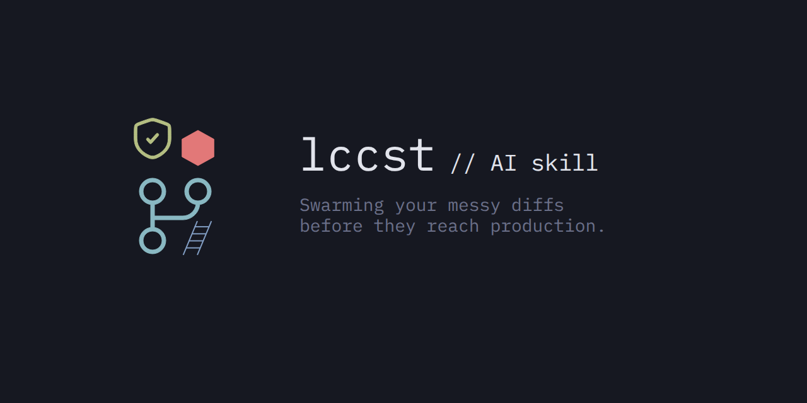

# LCCST (Locust)

A deterministic workspace gatekeeper that decomposes codebase changes into
isolated, test-verified, atomic Git commits. Enforces architectural cohesion
and SOLID invariants through a lean execution protocol.

> "Swarming your messy diffs before they reach production."

## Runtime Modes

### Bare Skill Mode

Load `SKILL.md` directly into the LLM context window. The model follows the
rules manually. No MCP server required.

### MCP Server Mode

The MCP server at `src/index.ts` (built to `dist/index.js`) exposes eleven tools programmatically:

- **`init`** -- Map project conventions and verify environment
- **`audit`** -- Scan workspace diffs and generate commit plan
- **`swarm`** -- Execute the full discovery-cluster-test-commit loop
- **`tooling`** -- Inventory Makefile targets, `scripts/` helpers, and package scripts
- **`lint`** -- Run lint (Makefile target first, manifest fallback)
- **`format`** -- Run format
- **`test`** -- Run test
- **`build`** -- Run build
- **`verify`** -- Run the full quality gate (format, lint, test, build)
- **`compliance`** -- Audit deliverable tiers
- **`version`** -- Report the current LCCST version

These tools map 1:1 to the slash commands documented in `SKILL.md`. The skill
runs standalone; the server is an optional programmatic front end.

Every path-taking tool accepts a `path` argument (default `.`). Absolute paths
preserved; `~` expands to `$HOME`; set `LCCST_WORKSPACE` to override the
workspace root. See `src/index.ts` for implementation details.

```bash
# Init detects the manifest and runs the native test command:
/init -> Detects go.mod     -> swarm runs `go test ./...`
/init -> Detects Cargo.toml -> swarm runs `cargo test`
/init -> Detects pyproject.toml -> swarm runs `uv run pytest`
/init -> Detects package.json -> swarm runs `pnpm test`
/init -> Detects CMakeLists.txt -> swarm runs `cmake --build .`
```

## Core Philosophy

- **UNIX philosophy over framework:** One skill file and one server file. No
  scaffolding the domain does not justify. Over-engineering is a correctness
  defect.
- **User conventions first:** Existing patterns, manifest commands, and
  explicit preferences take priority. Atomic hunk isolation, the Tooling
  Ladder, and strict test-pass verification are non-negotiable.
- **Quality over velocity:** Structural integrity and complete test
  verification beat raw speed. Token discipline applies to output, not
  internal reasoning.
- **Granularity over convenience:** Locality Clustering groups diffs by domain
  so each atomic commit rolls back cleanly. The extra commits buy a clear,
  reversible history.
- **Proportional defence:** Validation, rate limiting, and caching apply only
  where module exposure justifies them. Omit fabricated attack or load
  scenarios.
- **Ecosystem-native discovery:** LSP, Tree-sitter, and native test runners
  trace side effects; the Tooling Ladder prefers project scripts over bare
  binaries.
- **Token investment:** LCCST puns on low-cost asset management while
  clustering by locality. Tokens are strategic capital -- spent on tests,
  typing, and the Tooling Ladder, not on boilerplate.

## Installation

### Option A: GitHub Releases (Recommended)

Download the latest release from the
[releases page](https://github.com/bladeacer/lccst/releases). Each release
bundles `dist/index.js`, `SKILL.md`, `dist/index.d.ts`, `LICENSE`, and
`README.md`. Set the path to `dist/index.js` in your agent config. No install
or build needed.

### Option B: Zero-Setup Declarative Ingestion

For instruction-driven workflows that need no background processes.

- **Claude Code CLI:** `claude "Review the active git diff using the parameters in ./SKILL.md"`
- **GitHub Copilot & OpenCode:** Attach `#SKILL.md` or `@SKILL.md` in chat
- **Codex & harnesses:** `cat SKILL.md | your-agent-runner "Apply this system execution skill"`
- **Project-level binding:** Symlink `SKILL.md` as `.cursorrules`,
  `.clinerules`, or `.github/copilot-instructions.md`
- **Global profiles:** Paste into Cursor Rules, Windsurf Memories, VS Code
  `globalRules.json`, or JetBrains Custom Prompts

### Option C: Universal Package Registry

```bash
npx skills add bladeacer/lccst
/lccst
```

### Option D: MCP Server Setup

```bash
git clone --depth 1 https://github.com/bladeacer/lccst
cd lccst && pnpm install && pnpm run build
```

Add to your harness config:

```json
{
  "mcpServers": {
    "lccst": {
      "command": "node",
      "args": ["/absolute/path/to/lccst/dist/index.js"]
    }
  }
}
```

> Replace the path with your actual `dist/index.js`. The server is disabled by
> default (`enabled: false`).
> 
> Note: A harness is a programme you use to interface with and run AI models

**OpenCode:** Add the above to `opencode.jsonc` under `mcp.lccst`. The
`SKILL.md` is auto-discovered as an Agent Skill -- use `/lccst` or `@SKILL.md`
to invoke it.

## Development

Read `AGENTS.md` for build/test commands, deliverable tiers, and structural invariants.

| Tool | Version | Purpose |
|------|---------|---------|
| pnpm | >= 9 | Package manager |
| TypeScript | >= 5.4 | Compiling engine source |

```bash
pnpm run build           # Bundle deps + source -> dist/index.js
pnpm run test            # Run all tests
pnpm run test:swarm      # Swarm library unit tests only
pnpm run test:telemetry  # Telemetry MCP unit tests only
pnpm run test:picker     # Benchmark picker unit tests only
pnpm run test:e2e        # Telemetry end-to-end tests on real harnesses
pnpm run test:mcp        # MCP server integration tests only
pnpm run bench:list      # Models that the benchmark picker offers
pnpm run bump 1.0.0      # Bump version across all files
```

The end-to-end test starts a real harness with a real model, so it needs a
network connection. Set `E2E_HARNESS` or `LCCST_E2E_MODEL` to narrow the run.

Benchmarking has its own dependencies -- see [`playground/README.md`](playground/README.md).

## Playground and Benchmarking

Measures token impact of skill-guided vs plain code generation across three
reference projects (Python HTTP server, React timer, Go login CRUD).

```bash
make benchmark-free     # Ask for a harness and a model, then run the benchmark
make bench-list         # Show the models that the picker offers
```

The picker lists the models of every harness that the path holds, and it asks
for one in a fuzzy search. Type part of a model name and press Enter. Without
`fzf`, the picker asks for a filter and a number instead. A model is offered
only when the registry states that it calls tools, reads text, and writes text,
and when the registry states no charge for it, or when its name carries a free
marker. Routers, image models, and families that an author rejects for agentic
work are left out. The run then happens in a clean room outside the repository.
The target seeds `SKILL.md`, `README.md`, `guide.md`, `traps.md`, and
`agent-prompt.md` into the clean room, and it copies `agent-prompt.md` to
`AGENTS.md`, which the harness reads as the project instructions. The target
then starts the harness in the foreground so you can steer it. It settles the
token counts, writes the report, removes the clean room, and refreshes the table
below. Set `BENCH_PICK=0` to skip the picker and pass `HARNESS`, `PROVIDER`,
and `MODEL_NAME` yourself.

The picker needs a terminal, because the run that follows costs model tokens.
Set `BENCH_ALLOW_PIPE=1` only when a script must choose a model.

> **The run measures the model it names.** The run checks that the harness offers
> the model before it builds the clean room, and it gives the harness its own
> configuration directory and a private server, so the plugins, skills, agents,
> and servers of a user cannot change the run. The run also gives the harness its
> own state directory, because a harness restores the model that a user last
> chose for each agent, and that restored model wins over the model of the run.
> Kilo also receives the model on the command line. The report compares the model
> identifier that the run pinned with the model that the store of the host
> recorded. A report that names a different model is marked as wrong.

> **The run measures the prompt it names.** The instructions of a run carry a
> run token, and the model must state the token in its first reply. The settle
> step reads the text of the model turns and looks for the token. A run whose
> model never stated the token is a run that measured a different prompt, so
> the report marks the prompt as unverified.

> **Both columns are measured the same way.** The scanner applies one file
> filter and one test command to the `plain` and the `skill-guided` variant, and
> it scores both with the same rubric. A test failure is a measurement. A test
> run that cannot start, that times out, or that holds no test is an error, and
> an error never scores as a pass. The `plain` variant reads `README.md` and
> `guide.md`. The `skill-guided` variant reads those files plus `SKILL.md` and
> `traps.md`.

> **A run enters the table only when every check passes.** The table needs the
> version of the harness, a measured count for every phase, a model that the
> host store confirms, a stated run token, and a passing skill-guided variant at
> 100 percent for all three subprojects. A run that fails a check stays on disk,
> and the table leaves it out. The report states the reason.

> **Every report names the harness version.** A harness version changes the
> prompt, the tool list, and the token accounting, so a report that names no
> version cannot be reproduced. The scanner asks the harness for its version and
> records the version with the path of the command.

> **How runtime tokens are measured.** A model cannot read its own token usage,
> so the `lccst-telemetry` MCP server measures it. The model marks the end of
> each phase, and the settle step then reads the token counts of every model
> turn of that phase from the store of the harness that ran it. The reader
> names no harness, so the same server measures `opencode` and `kilo`.
>
> The server checks the workspace before it records a phase. A call that arrives
> before the phase holds its directory and its manifest records nothing, and a
> second call for the same phase corrects the end of that phase. A call that
> came too early therefore costs one more call, and it never costs a phase.
>
> Every run before `v3.7.0` used counts that the model under test supplied, so
> those Agent Runtime Tokens (ART) figures were estimates. The old findings are
> removed. The table below fills again after the next benchmark run.
>
> The scanner changed after the first `v3.7.0` run, so the file token counts and
> the robustness scores of a new report are not comparable with the removed
> reports. A report that predates the change counted the test files of one
> variant and not the other.

<!-- BENCHMARK_RESULTS_START -->

#### opencode/opencode/space-bunny-free: skill version v3.8.0

| Provider | Harness | Harness Version | Model | Skill Layer | Context Tools (MCP) | Subproject | Plain Score | Skill-Guided | Test Status | FCT (Plain) | FCT (Guided) | ART (Plain) | ART (Guided) |
| :--- | :--- | :--- | :--- | :--- | :--- | :--- | :---: | :---: | :---: | :---: | :---: | :---: | :---: |
| `opencode` | **opencode** | `v2.0.20` | `space-bunny-free` | `v3.8.0` | `lccst-telemetry` | **python-http-server** | 83/100 | **100/100** | PASSED | 2,345 | 8,116 | 179,173 | 502,581 |
| `opencode` | **opencode** | `v2.0.20` | `space-bunny-free` | `v3.8.0` | `lccst-telemetry` | **react-timer** | 47/100 | **100/100** | PASSED | 2,544 | 4,166 | 899,775 | 565,717 |
| `opencode` | **opencode** | `v2.0.20` | `space-bunny-free` | `v3.8.0` | `lccst-telemetry` | **go-login-crud** | 100/100 | **100/100** | PASSED | 4,457 | 13,452 | 1,729,503 | 2,541,943 |
| **Summary** | | | | | **Workspace Totals / Avg** | **77/100** | **100/100** | **3/3 Passed** | **9,346** | **25,734** | **2,808,451** | **3,610,241** |

> **Highest ART subproject:** `go-login-crud` consumed the most guided runtime
> tokens.
> **Highest FCT subproject:** `go-login-crud` consumed the most guided FCT
> tokens.
> Skill-guided implementation used **+175%** more FCT and **+29%** more ART
> compared to plain implementation across the workspace suite.

#### kilo/kilo/stealth-space-bunny-alpha: skill version v3.8.0

| Provider | Harness | Harness Version | Model | Skill Layer | Context Tools (MCP) | Subproject | Plain Score | Skill-Guided | Test Status | FCT (Plain) | FCT (Guided) | ART (Plain) | ART (Guided) |
| :--- | :--- | :--- | :--- | :--- | :--- | :--- | :---: | :---: | :---: | :---: | :---: | :---: | :---: |
| `kilo` | **kilo** | `v7.7.9` | `stealth-space-bunny-alpha` | `v3.8.0` | `lccst-telemetry` | **python-http-server** | 83/100 | **100/100** | PASSED | 2,397 | 8,309 | 230,291 | 781,186 |
| `kilo` | **kilo** | `v7.7.9` | `stealth-space-bunny-alpha` | `v3.8.0` | `lccst-telemetry` | **react-timer** | 47/100 | **100/100** | PASSED | 1,533 | 3,725 | 444,659 | 1,145,016 |
| `kilo` | **kilo** | `v7.7.9` | `stealth-space-bunny-alpha` | `v3.8.0` | `lccst-telemetry` | **go-login-crud** | 100/100 | **100/100** | PASSED | 6,260 | 16,756 | 1,073,902 | 3,057,677 |
| **Summary** | | | | | **Workspace Totals / Avg** | **77/100** | **100/100** | **3/3 Passed** | **10,190** | **28,790** | **1,748,852** | **4,983,879** |

> **Highest ART subproject:** `go-login-crud` consumed the most guided runtime
> tokens.
> **Highest FCT subproject:** `go-login-crud` consumed the most guided FCT
> tokens.
> Skill-guided implementation used **+183%** more FCT and **+185%** more ART
> compared to plain implementation across the workspace suite.


### Benchmark Summary

| Metric | `opencode-opencode-space-bunny-free` | `kilo-kilo-stealth-space-bunny-alpha` |
| --- | --- | --- |
| Harness | opencode | kilo |
| Harness version | v2.0.20 | v7.7.9 |
| Plain score | 77/100 | 77/100 |
| Guided score | 100/100 | 100/100 |
| Plain FCT | 9,346 | 10,190 |
| Guided FCT | 25,734 | 28,790 |
| FCT overhead | +175% | +183% |
| Plain ART | 2,808,451 | 1,748,852 |
| Guided ART | 3,610,241 | 4,983,879 |
| ART overhead | +29% | +185% |
| Tests passed | 3/3 | 3/3 |

#### Token Efficiency

All evaluated models (`opencode-opencode-space-bunny-free` and
`kilo-kilo-stealth-space-bunny-alpha`) achieved a perfect guided score of
100/100 under the protocol. However, their resource efficiency varied
significantly:

* **`opencode-opencode-space-bunny-free`** entered with the strongest plain
  baseline (77/100) and reached perfection with +175% FCT and +29% ART overhead
  -- representing a genuine quality investment rather than recovery from
  failure.

* **`kilo-kilo-stealth-space-bunny-alpha`** also delivered a perfect guided
  score, with +183% FCT and +185% ART overhead.

Across all runners, `go-login-crud` remained the most resource-intensive
subproject.

#### Least Token Usage

`opencode-opencode-space-bunny-free` consumed the fewest tokens overall
(6,453,772): 9,346 plain FCT, 25,734 guided FCT, 2,808,451 plain ART, and
3,610,241 guided ART.

#### Overall Top Models

| Rank | Agent-Model | Plain Score | Guided Score | FCT Overhead | ART Overhead | Verdict |
| ---: | :--- | :---: | :---: | :---: | :---: | :--- |
| 1 | `opencode-opencode-space-bunny-free` | 77/100 | 100/100 | +175% | +29% | Best overall |
| 2 | `kilo-kilo-stealth-space-bunny-alpha` | 77/100 | 100/100 | +183% | +185% | Strong contender |

See [`model-ranking.md`](model-ranking.md) for the full ranking of all benchmark runs.

> Only benchmark runs which perform well enough are included


<!-- BENCHMARK_RESULTS_END -->


